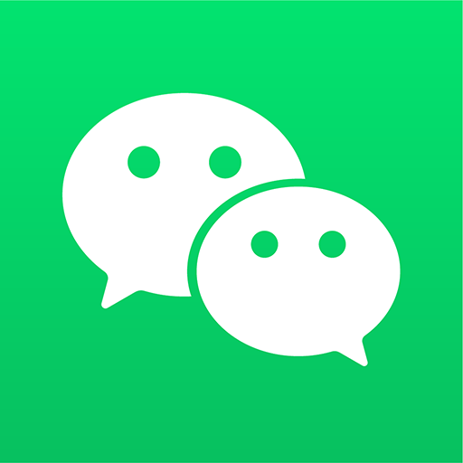

# Bekannte Messenger im Vergleich zu WeChat

Leon Weber

---

## Inhaltsangabe

- Liste bekannter Messenger
- Funktionen und Besonderheiten von WeChat
- Entstehung und Ursprung von WeChat
- Datenschutz und Privatsphäre
- Verbreitung von WeChat in China
- Vergleich mit anderen Messengern
- Quellen

---

## Liste von Messengern

1. WhatsApp
2. WeChat
3. Facebook Messenger
4. Telegram
5. Signal

---

## Funktionen und Besonderheiten von WeChat

- **WeChat** ist eine chinesische App von **Tencent**.
- Die App verbindet Chat, Anrufe und soziale Funktionen.
- WeChat wird vor allem in **China** genutzt und ist dort ein wichtiger Teil des digitalen Alltags.
- Zusätzlich bietet die App **Bezahlen**, **Shopping**, Nachrichten und verschiedene **Mini-Programme**.

---

## Entstehung und Ursprung von WeChat

- **WeChat** wurde **2011** von **Tencent** in China entwickelt.
- Der ursprüngliche Name der App war **„Weixin“**.
- Am Anfang war WeChat ein einfacher Messenger für Text- und Sprachnachrichten.
- Später kamen **Videoanrufe**, soziale Netzwerke, Bezahlen und Mini-Programme hinzu.
- Heute ist WeChat eine der wichtigsten digitalen Plattformen in **China**.

---

## Datenschutz und Privatsphäre von WeChat

- WeChat sammelt und verarbeitet viele **Daten** seiner Nutzer.
- Unter bestimmten Voraussetzungen können Daten an **chinesische Behörden** weitergegeben werden.
- Deshalb wird der Umgang mit persönlichen Daten bei WeChat oft kritisch diskutiert.

---

## Verbreitung von WeChat in China

- WeChat hat sich in China als wichtige App etabliert.
- Die App bietet immer mehr Funktionen über das einfache Chatten hinaus.
- WeChat wird für Kommunikation, Bezahlen und Einkaufen genutzt.
- Auch Unternehmen und Geschäfte verwenden WeChat im Alltag.
- Dadurch entwickelte sich WeChat von einem Messenger zu einer zentralen digitalen Plattform.

---

## Vergleich der Messenger

- **Verbreitung:** WeChat vor allem in China, WhatsApp weltweit, Signal weltweit mit weniger Nutzern.
- **Fokus:** WeChat als Messenger mit vielen Diensten, WhatsApp für Kommunikation, Signal für Datenschutz.
- **Datenschutz:** WeChat eher gering, WhatsApp mittel, Signal hoch.

---

## Vergleich: Sicherheit und Funktionen

- **Verschlüsselung:** WeChat eingeschränkt, WhatsApp und Signal Ende-zu-Ende.
- **Werbung:** WeChat teilweise, WhatsApp im Meta-Werbeumfeld, Signal keine.
- **Zusatzfunktionen:** WeChat sehr viele, WhatsApp einige, Signal wenige.

---

## Vergleich: Bezahlen und Besonderheiten

- **Bezahlen:** WeChat ja, WhatsApp teilweise, Signal nein.
- **Besonderheit:** WeChat als Super-App, WhatsApp sehr verbreitet, Signal sehr privat.

---

## Quellen

- [Citizen Lab: Datenschutz bei WeChat](https://citizenlab.ca/research/privacy-in-the-wechat-ecosystem-full-report/)
- [Tencent: Geschichte des Unternehmens](https://www.tencent.com/who-we-are/our-story/)
- [DataReportal: Digitale Nutzung 2026](https://datareportal.com/reports/digital-2026-two-in-three-people-use-social-media)
- [Tencent: Weixin und WeChat](https://www.tencent.com/products/weixin-wechat/)
